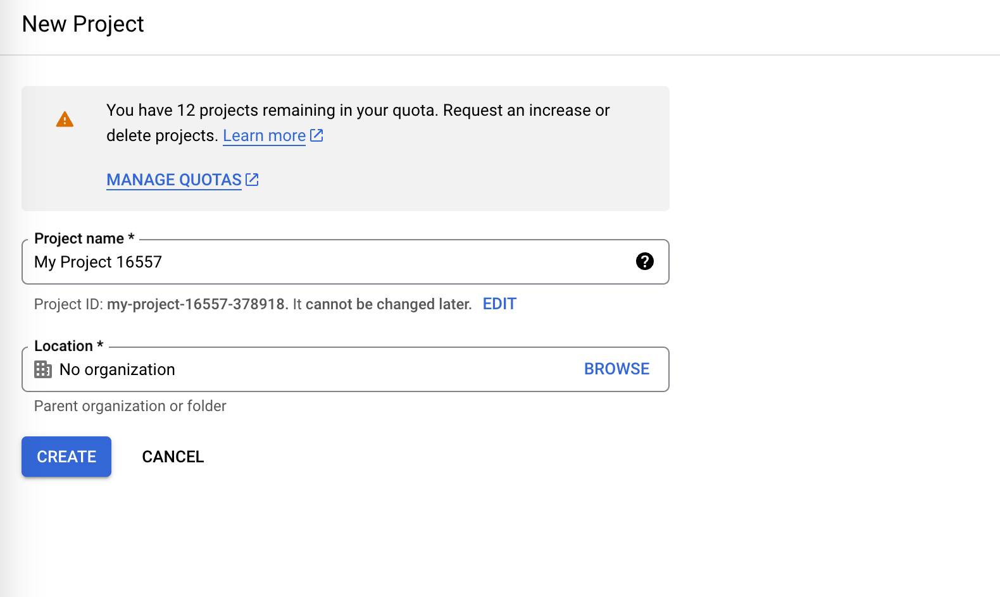
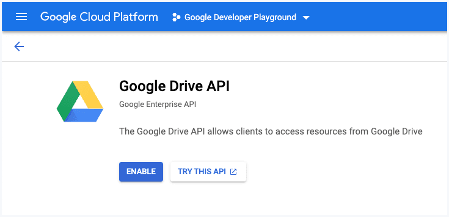
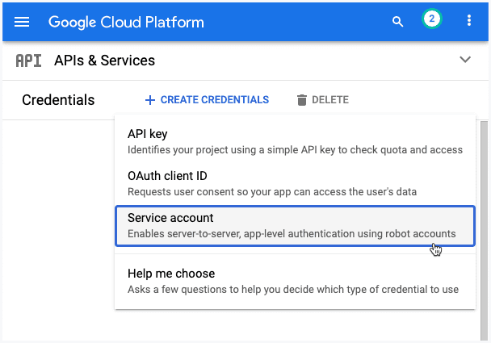
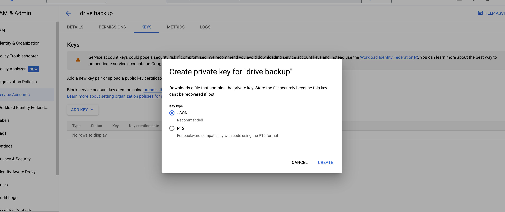

# Auto backup database mysql to GGdrive

This tutorial explains how you can connect to `Google Drive` or any other `Google API` from a service account without user authentication.

This step by step guide will guide you on how to upload files to `Google Drive `with a service account using `Node.js`.

## Getting Started 
# 1. Create a Google Cloud Project
Go to `cloud.google.com` and create a new Google Cloud project. Give your project a name, change the project ID and click the `Create` button.

## 2. Enable Google APIs
Choose `APIs & Services` from the left menu and click on `Enable APIs and Services` to enable the various Google APIs. If you planning to upload files to Google Drive then you will need to enable Drive API. If you wish to use the Google Cloud Storage API then you will need to enable Storage API.

## 3. Create a Service Account
In the `APIs & Services` section, click on `Credentials` and click on Create credentials to `create a service account`.

### 3a. Describe the Service Account
Give your service account a name and a service account ID. This is like an email address and will be used to identify your service account in the future. Click `Done` to finish creating the service account.

### 3b. Create a Key File
In the `Cloud Console`, go to IAM and Admin > Service accounts page. Click the email address of the service account that you want to create a key for. Click the `Keys` tab. Click the `Add key` drop-down menu, then select Create new key.

Select `JSON` as the Key type and then click Create. This will download a JSON file that will contain your private key. Do not commit this file to the Github repository.


## 4. Share a Drive Folder
For this example, we are looking to upload files from a local folder to a specific folder in Google Drive.

Go to your Google Drive and create a new folder. Right-click the folder, choose Share and add the email address of the service account you created in step 3 as an editor to this folder.

Thus your Node.js application will be able to access this folder and upload files to it. The application will not have access to any other resources on your Google Drive.

## Usage
1. Clone the repo:
```bash
https://github.com/1412dev/auto-backup-mysql-with-nodejs.git
```
2. cd into the project and run npm install (to install dependencies)
```bash
cd auto-backup-mysql-with-nodejs
```
3. Edit `index.js`
`edit localhost, root, user, pass replace with database info for you`
```
generate_mysql_dump("localhost", "root", "user", "pass", file_name);
```
`edit folder_id with folder id ggdrive for you`
```
upload_file_on_google_drive(file_name, "folder_id", true);
```
4. Copy `data` file .json download in `3b` to `key.json`
5. RUN
```bash
npm install
node index.js
```

## Contributing

Pull requests are welcome. For major changes, please open an issue first
to discuss what you would like to change.

Please make sure to update tests as appropriate.

## License

[MIT](https://choosealicense.com/licenses/mit/)
